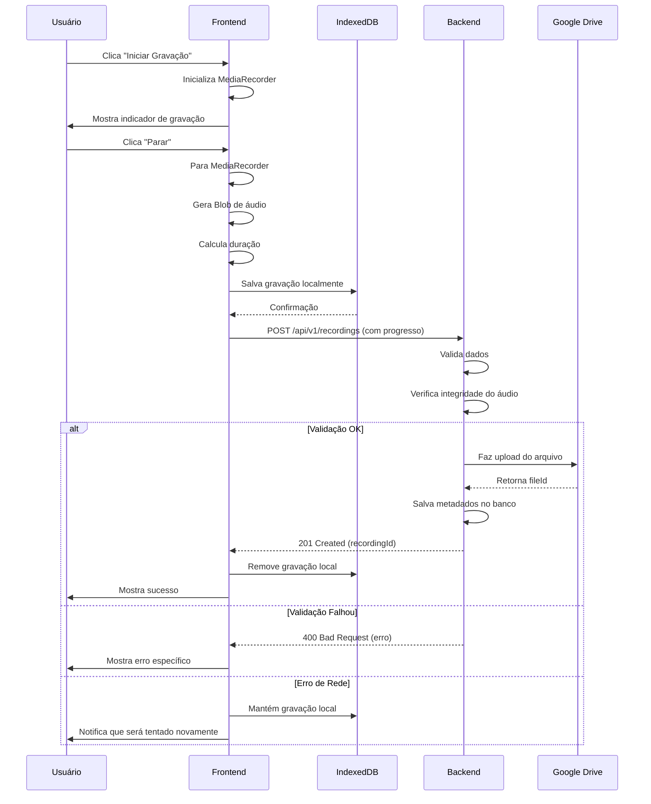

# Blueprint - API de Gravação de Áudio (Upload Completo)

## 1. Objetivo

Esta API recebe gravações de áudio **completas** do frontend (não em streaming), juntamente com metadados essenciais, e orquestra o salvamento desses arquivos em um serviço de armazenamento externo.

## 2. Endpoint de Upload

### `POST /api/v1/recordings`

- **Método:** `POST`
- **Content-Type:** `multipart/form-data`
- **Tamanho Máximo:** 50MB por arquivo
- **Timeout:** 60 segundos
- **Autenticação:** Bearer Token (obrigatório)

## 3. Formato da Requisição

### Campos Obrigatórios

| Campo | Tipo | Descrição |
|:---|:---|:---|
| `audio` | `File` | Arquivo de áudio completo (webm, wav, mp3, ogg) |
| `userId` | `String` | ID do usuário autenticado |
| `sessionId` | `String` | UUID da sessão de gravação |
| `datasetId` | `Number` | ID do dataset (ex: 1=Voz Geral, 2=Canto) |
| `phraseId` | `Number` | ID da frase gravada |
| `duration` | `Number` | Duração em segundos (validado no backend) |
| `recordedAt` | `String` | Timestamp ISO 8601 de quando foi gravada |

### Campos Opcionais

| Campo | Tipo | Descrição |
|:---|:---|:---|
| `emotionId` | `Number` | ID da emoção associada |
| `format` | `String` | Formato do áudio (auto-detectado se omitido) |
| `deviceInfo` | `JSON String` | Informações do dispositivo |

---

## 4. Exemplo de Implementação no Frontend

### 4.1. Gerar SessionId (uma vez por sessão)

```javascript
// src/utils/session.ts
export function generateSessionId(): string {
  return crypto.randomUUID();
}

// Salvar no estado da aplicação
const [sessionId] = useState(() => generateSessionId());
```

### 4.2. Capturar Gravação Completa

```javascript
// src/hooks/useAudioRecorder.ts
import { useState, useRef } from 'react';

export function useAudioRecorder() {
  const [isRecording, setIsRecording] = useState(false);
  const mediaRecorderRef = useRef<MediaRecorder | null>(null);
  const chunksRef = useRef<Blob[]>([]);

  const startRecording = async () => {
    const stream = await navigator.mediaDevices.getUserMedia({ audio: true });
    const mediaRecorder = new MediaRecorder(stream, {
      mimeType: 'audio/webm;codecs=opus'
    });
    
    chunksRef.current = [];
    
    mediaRecorder.ondataavailable = (event) => {
      if (event.data.size > 0) {
        chunksRef.current.push(event.data);
      }
    };
    
    mediaRecorderRef.current = mediaRecorder;
    mediaRecorder.start();
    setIsRecording(true);
  };

  const stopRecording = (): Promise<Blob> => {
    return new Promise((resolve) => {
      const mediaRecorder = mediaRecorderRef.current;
      if (!mediaRecorder) return;

      mediaRecorder.onstop = () => {
        const audioBlob = new Blob(chunksRef.current, { type: 'audio/webm' });
        
        // Limpar stream
        mediaRecorder.stream.getTracks().forEach(track => track.stop());
        setIsRecording(false);
        
        resolve(audioBlob);
      };

      mediaRecorder.stop();
    });
  };

  return { isRecording, startRecording, stopRecording };
}
```

### 4.3. Upload com Retry e Progresso

```javascript
// src/services/recordingApi.ts
interface UploadRecordingParams {
  audioBlob: Blob;
  userId: string;
  sessionId: string;
  datasetId: number;
  phraseId: number;
  emotionId?: number;
  recordedAt: string;
}

interface UploadProgress {
  loaded: number;
  total: number;
  percentage: number;
}

export async function uploadRecording(
  params: UploadRecordingParams,
  onProgress?: (progress: UploadProgress) => void,
  maxRetries = 3
): Promise<{ recordingId: string }> {
  
  // Calcular duração do áudio
  const duration = await getAudioDuration(params.audioBlob);
  
  const formData = new FormData();
  formData.append('audio', params.audioBlob, 'recording.webm');
  formData.append('userId', params.userId);
  formData.append('sessionId', params.sessionId);
  formData.append('datasetId', params.datasetId.toString());
  formData.append('phraseId', params.phraseId.toString());
  formData.append('duration', duration.toString());
  formData.append('recordedAt', params.recordedAt);
  formData.append('format', 'webm');
  
  if (params.emotionId) {
    formData.append('emotionId', params.emotionId.toString());
  }
  
  // Informações do dispositivo
  const deviceInfo = {
    userAgent: navigator.userAgent,
    platform: navigator.platform,
    language: navigator.language
  };
  formData.append('deviceInfo', JSON.stringify(deviceInfo));

  // Tentar upload com retry
  for (let attempt = 0; attempt < maxRetries; attempt++) {
    try {
      const response = await uploadWithProgress(formData, onProgress);
      
      if (response.ok) {
        return await response.json();
      }
      
      // Se erro 4xx, não tentar novamente
      if (response.status >= 400 && response.status < 500) {
        const error = await response.json();
        throw new Error(error.message || 'Erro ao fazer upload');
      }
      
      // Se erro 5xx e não é última tentativa, aguardar e tentar novamente
      if (attempt < maxRetries - 1) {
        await sleep(2000 * (attempt + 1)); // Backoff exponencial
        continue;
      }
      
      throw new Error(`Upload falhou com status ${response.status}`);
      
    } catch (error) {
      if (attempt === maxRetries - 1) {
        throw error;
      }
      // Aguardar antes de tentar novamente
      await sleep(2000 * (attempt + 1));
    }
  }
  
  throw new Error('Falha ao fazer upload após múltiplas tentativas');
}

// Função auxiliar para upload com progresso
function uploadWithProgress(
  formData: FormData,
  onProgress?: (progress: UploadProgress) => void
): Promise<Response> {
  return new Promise((resolve, reject) => {
    const xhr = new XMLHttpRequest();
    
    xhr.upload.addEventListener('progress', (event) => {
      if (event.lengthComputable && onProgress) {
        onProgress({
          loaded: event.loaded,
          total: event.total,
          percentage: Math.round((event.loaded / event.total) * 100)
        });
      }
    });
    
    xhr.addEventListener('load', () => {
      resolve(new Response(xhr.response, {
        status: xhr.status,
        statusText: xhr.statusText
      }));
    });
    
    xhr.addEventListener('error', () => {
      reject(new Error('Erro de rede ao fazer upload'));
    });
    
    xhr.addEventListener('abort', () => {
      reject(new Error('Upload cancelado'));
    });
    
    const token = localStorage.getItem('authToken');
    xhr.open('POST', '/api/v1/recordings');
    xhr.setRequestHeader('Authorization', `Bearer ${token}`);
    xhr.send(formData);
  });
}

// Calcular duração do áudio
async function getAudioDuration(blob: Blob): Promise<number> {
  return new Promise((resolve, reject) => {
    const audio = new Audio();
    audio.preload = 'metadata';
    
    audio.onloadedmetadata = () => {
      URL.revokeObjectURL(audio.src);
      resolve(audio.duration);
    };
    
    audio.onerror = () => {
      reject(new Error('Erro ao carregar metadados do áudio'));
    };
    
    audio.src = URL.createObjectURL(blob);
  });
}

function sleep(ms: number): Promise<void> {
  return new Promise(resolve => setTimeout(resolve, ms));
}
```

### 4.4. Integração na Página de Gravação

```javascript
// src/pages/RecordingPage.tsx
import { useState, useEffect } from 'react';
import { useAudioRecorder } from '../hooks/useAudioRecorder';
import { uploadRecording } from '../services/recordingApi';
import { saveRecordingLocally, getFailedUploads } from '../services/localStorage';

export function RecordingPage() {
  const [sessionId] = useState(() => crypto.randomUUID());
  const [uploadProgress, setUploadProgress] = useState(0);
  const [isUploading, setIsUploading] = useState(false);
  
  const { isRecording, startRecording, stopRecording } = useAudioRecorder();
  
  // Tentar reenviar gravações falhadas ao carregar
  useEffect(() => {
    retryFailedUploads();
  }, []);
  
  const handleStopAndUpload = async (phraseId: number, emotionId?: number) => {
    try {
      // 1. Parar gravação e obter blob completo
      const audioBlob = await stopRecording();
      
      // 2. Salvar localmente como backup
      const recordedAt = new Date().toISOString();
      await saveRecordingLocally({
        audioBlob,
        sessionId,
        phraseId,
        emotionId,
        recordedAt
      });
      
      // 3. Fazer upload
      setIsUploading(true);
      
      const result = await uploadRecording(
        {
          audioBlob,
          userId: 'user_123', // Obter do contexto de autenticação
          sessionId,
          datasetId: 2, // Obter do contexto
          phraseId,
          emotionId,
          recordedAt
        },
        (progress) => {
          setUploadProgress(progress.percentage);
        }
      );
      
      console.log('Upload bem-sucedido:', result.recordingId);
      
      // 4. Remover do armazenamento local após sucesso
      // removeRecordingLocally(localId);
      
    } catch (error) {
      console.error('Erro ao fazer upload:', error);
      alert('Erro ao enviar gravação. Ela foi salva e será reenviada automaticamente.');
    } finally {
      setIsUploading(false);
      setUploadProgress(0);
    }
  };
  
  const retryFailedUploads = async () => {
    const failedUploads = await getFailedUploads();
    
    for (const upload of failedUploads) {
      try {
        await uploadRecording({
          audioBlob: upload.audioBlob,
          userId: upload.userId,
          sessionId: upload.sessionId,
          datasetId: upload.datasetId,
          phraseId: upload.phraseId,
          emotionId: upload.emotionId,
          recordedAt: upload.recordedAt
        });
        
        // Remover após sucesso
        // removeRecordingLocally(upload.id);
      } catch (error) {
        console.error('Falha ao reenviar:', error);
      }
    }
  };

  return (
    <div>
      <button 
        onClick={startRecording} 
        disabled={isRecording || isUploading}
      >
        Iniciar Gravação
      </button>
      
      <button 
        onClick={() => handleStopAndUpload(15, 1)} 
        disabled={!isRecording || isUploading}
      >
        Parar e Enviar
      </button>
      
      {isUploading && (
        <div>
          <p>Enviando... {uploadProgress}%</p>
          <progress value={uploadProgress} max="100" />
        </div>
      )}
    </div>
  );
}
```

### 4.5. Armazenamento Local (IndexedDB)

```javascript
// src/services/localStorage.ts
import { openDB, DBSchema, IDBPDatabase } from 'idb';

interface RecordingDB extends DBSchema {
  recordings: {
    key: string;
    value: {
      id: string;
      audioBlob: Blob;
      userId: string;
      sessionId: string;
      datasetId: number;
      phraseId: number;
      emotionId?: number;
      recordedAt: string;
      failedAt: string;
    };
  };
}

let db: IDBPDatabase<RecordingDB>;

async function getDB() {
  if (!db) {
    db = await openDB<RecordingDB>('RecordingsDB', 1, {
      upgrade(db) {
        db.createObjectStore('recordings', { keyPath: 'id' });
      },
    });
  }
  return db;
}

export async function saveRecordingLocally(recording: {
  audioBlob: Blob;
  sessionId: string;
  phraseId: number;
  emotionId?: number;
  recordedAt: string;
}) {
  const db = await getDB();
  const id = crypto.randomUUID();
  
  await db.add('recordings', {
    id,
    ...recording,
    userId: 'user_123', // Obter do contexto
    datasetId: 2, // Obter do contexto
    failedAt: new Date().toISOString()
  });
  
  return id;
}

export async function getFailedUploads() {
  const db = await getDB();
  return db.getAll('recordings');
}

export async function removeRecordingLocally(id: string) {
  const db = await getDB();
  await db.delete('recordings', id);
}
```

---

## 5. Respostas da API

### Sucesso (201 Created)

```json
{
  "status": "success",
  "message": "Gravação salva com sucesso",
  "recordingId": "rec_a1b2c3d4e5f6",
  "driveFileId": "1a2b3c4d5e6f7g8h",
  "uploadedAt": "2025-12-08T14:30:00Z"
}
```

### Erro - Validação (400 Bad Request)

```json
{
  "status": "error",
  "code": "VALIDATION_ERROR",
  "message": "Dados inválidos",
  "errors": [
    {
      "field": "duration",
      "message": "Duração do áudio não corresponde ao arquivo"
    },
    {
      "field": "audio",
      "message": "Arquivo muito grande (máximo 50MB)"
    }
  ]
}
```

### Erro - Autenticação (401 Unauthorized)

```json
{
  "status": "error",
  "code": "UNAUTHORIZED",
  "message": "Token de autenticação inválido ou expirado"
}
```

### Erro - Formato Inválido (415 Unsupported Media Type)

```json
{
  "status": "error",
  "code": "INVALID_FORMAT",
  "message": "Formato de áudio não suportado",
  "details": {
    "receivedFormat": "audio/avi",
    "supportedFormats": ["audio/webm", "audio/wav", "audio/mp3", "audio/ogg"]
  }
}
```

### Erro - Rate Limit (429 Too Many Requests)

```json
{
  "status": "error",
  "code": "RATE_LIMIT_EXCEEDED",
  "message": "Muitas requisições. Tente novamente em 60 segundos",
  "retryAfter": 60
}
```

### Erro - Servidor (500 Internal Server Error)

```json
{
  "status": "error",
  "code": "STORAGE_ERROR",
  "message": "Falha ao salvar no Google Drive",
  "timestamp": "2025-12-08T14:30:00Z",
  "requestId": "req_xyz789"
}
```

---

## 6. Validações no Backend

### 6.1. Checklist de Validações Obrigatórias

```python
# Pseudocódigo das validações
def validate_recording(request):
    # 1. Validar autenticação
    token = request.headers.get('Authorization')
    if not is_valid_token(token):
        raise UnauthorizedError("Token inválido")
    
    # 2. Validar tamanho
    if request.files['audio'].size > 50_000_000:  # 50MB
        raise ValidationError("Arquivo muito grande")
    
    # 3. Validar formato
    allowed_formats = ['audio/webm', 'audio/wav', 'audio/mp3', 'audio/ogg']
    if request.files['audio'].content_type not in allowed_formats:
        raise ValidationError("Formato não suportado")
    
    # 4. Validar duração
    actual_duration = get_audio_duration(request.files['audio'])
    claimed_duration = float(request.form['duration'])
    
    if abs(actual_duration - claimed_duration) > 1:  # Tolerância de 1s
        raise ValidationError("Duração não corresponde")
    
    # 5. Validar IDs existem no banco
    if not Dataset.exists(request.form['datasetId']):
        raise ValidationError("Dataset não encontrado")
    
    if not Phrase.exists(request.form['phraseId']):
        raise ValidationError("Frase não encontrada")
    
    if request.form.get('emotionId'):
        if not Emotion.exists(request.form['emotionId']):
            raise ValidationError("Emoção não encontrada")
    
    # 6. Validar integridade do áudio
    if not is_valid_audio_file(request.files['audio']):
        raise ValidationError("Arquivo de áudio corrompido")
    
    # 7. Rate limiting
    if exceeded_rate_limit(user_id=request.form['userId']):
        raise RateLimitError("Muitas requisições")
```

### 6.2. Validação de Integridade do Áudio

```python
def is_valid_audio_file(file):
    """Verifica se o arquivo de áudio é válido e não está corrompido"""
    try:
        # Tentar ler metadados do áudio
        audio = AudioSegment.from_file(file)
        
        # Verificar se tem conteúdo
        if len(audio) == 0:
            return False
        
        # Verificar se tem sample rate válido
        if audio.frame_rate < 8000 or audio.frame_rate > 48000:
            return False
        
        return True
    except Exception:
        return False
```

---

## 7. Estrutura de Armazenamento

### 7.1. Organização no Google Drive

```
Google Drive:
/VoiceDatasets/
  Dataset_1_VozGeral/
    User_user123/
      Session_a1b2c3d4-e5f6-7890/
        rec_abc123_phrase10_emotion0_20251208_143000.webm
        rec_def456_phrase11_emotion1_20251208_143030.webm
  
  Dataset_2_Canto/
    User_user456/
      Session_b2c3d4e5-f6a7-8901/
        rec_ghi789_phrase15_emotion2_20251208_150000.webm
```

### 7.2. Convenção de Nomenclatura

**Formato:** `rec_{recordingId}_phrase{phraseId}_emotion{emotionId}_{timestamp}.{format}`

**Exemplos:**
- `rec_abc123_phrase10_emotion0_20251208_143000.webm`
- `rec_def456_phrase15_emotion2_20251208_150530.wav`

**Onde:**
- `recordingId`: ID único gerado pelo backend
- `phraseId`: ID da frase gravada
- `emotionId`: ID da emoção (0 se não houver)
- `timestamp`: Data e hora no formato `YYYYMMDD_HHMMSS`
- `format`: Extensão do arquivo (webm, wav, mp3, ogg)

---

## 8. Endpoints Adicionais Úteis

### 8.1. Criar Nova Sessão

```
POST /api/v1/sessions
Authorization: Bearer <token>

Request Body:
{
  "userId": "user_123",
  "datasetId": 2
}

Response (201 Created):
{
  "status": "success",
  "sessionId": "a1b2c3d4-e5f6-7890-1234-567890abcdef",
  "createdAt": "2025-12-08T14:00:00Z"
}
```

### 8.2. Listar Gravações de uma Sessão

```
GET /api/v1/recordings?sessionId={sessionId}
Authorization: Bearer <token>

Response (200 OK):
{
  "status": "success",
  "recordings": [
    {
      "recordingId": "rec_abc123",
      "phraseId": 15,
      "emotionId": 1,
      "duration": 3.5,
      "uploadedAt": "2025-12-08T14:30:00Z",
      "driveFileId": "1a2b3c4d5e6f7g8h"
    },
    {
      "recordingId": "rec_def456",
      "phraseId": 16,
      "emotionId": 2,
      "duration": 4.2,
      "uploadedAt": "2025-12-08T14:32:00Z",
      "driveFileId": "2b3c4d5e6f7g8h9i"
    }
  ],
  "total": 2
}
```

### 8.3. Deletar Gravação

```
DELETE /api/v1/recordings/{recordingId}
Authorization: Bearer <token>

Response (200 OK):
{
  "status": "success",
  "message": "Gravação deletada com sucesso",
  "recordingId": "rec_abc123"
}
```

### 8.4. Verificar Status de Upload (para processamento assíncrono)

```
GET /api/v1/recordings/{recordingId}/status
Authorization: Bearer <token>

Response (200 OK):
{
  "status": "completed", // ou "processing", "failed"
  "recordingId": "rec_abc123",
  "uploadedAt": "2025-12-08T14:30:00Z",
  "driveFileId": "1a2b3c4d5e6f7g8h"
}
```

---

## 9. Segurança

### 9.1. Autenticação e Autorização

- **Autenticação:** Todas as requisições devem incluir um Bearer Token válido no header `Authorization`
- **Rate Limiting:** Máximo de 100 uploads por hora por usuário
- **Validação de Ownership:** Usuários só podem acessar suas próprias gravações

### 9.2. Validação de Arquivos

- **Tamanho máximo:** 50MB
- **Formatos permitidos:** webm, wav, mp3, ogg
- **Validação de MIME type:** Verificar tanto no frontend quanto no backend
- **Scan de malware:** Recomendado para produção

### 9.3. CORS

```python
# Configuração de CORS no backend
ALLOWED_ORIGINS = [
    'https://app.seudominio.com',
    'http://localhost:3000'  # Apenas em desenvolvimento
]

CORS_HEADERS = {
    'Access-Control-Allow-Origin': ALLOWED_ORIGINS,
    'Access-Control-Allow-Methods': 'POST, GET, DELETE, OPTIONS',
    'Access-Control-Allow-Headers': 'Content-Type, Authorization',
    'Access-Control-Max-Age': '3600'
}
```

---

## 10. Considerações de Performance

### 10.1. Compressão

- **Frontend:** Gravar em formato comprimido (webm com opus)
- **Backend:** Considerar compressão adicional para armazenamento de longo prazo

### 10.2. Processamento Assíncrono (Opcional)

Para uploads muito grandes ou quando há necessidade de processamento adicional:

1. Backend retorna `202 Accepted` imediatamente
2. Arquivo é processado em background (worker/queue)
3. Frontend consulta status periodicamente

```javascript
// Exemplo de polling
async function waitForProcessing(recordingId: string) {
  const maxAttempts = 30;
  const interval = 2000; // 2 segundos
  
  for (let i = 0; i < maxAttempts; i++) {
    const status = await fetch(`/api/v1/recordings/${recordingId}/status`, {
      headers: { 'Authorization': `Bearer ${token}` }
    }).then(r => r.json());
    
    if (status.status === 'completed') {
      return status;
    }
    
    if (status.status === 'failed') {
      throw new Error('Processamento falhou');
    }
    
    await sleep(interval);
  }
  
  throw new Error('Timeout ao aguardar processamento');
}
```

### 10.3. CDN e Cache

- **Google Drive:** Considerar usar Google Cloud Storage com CDN para downloads
- **Metadados:** Cache de metadados (dataset, phrases, emotions) no frontend

---

## 11. Monitoramento e Logs

### 11.1. Métricas Importantes

- Taxa de sucesso/falha de uploads
- Tempo médio de upload por tamanho de arquivo
- Tempo de processamento no backend
- Taxa de retry por erro de rede
- Utilização de armazenamento

### 11.2. Logs Essenciais

```python
# Exemplo de log estruturado
{
  "event": "recording_upload",
  "timestamp": "2025-12-08T14:30:00Z",
  "userId": "user_123",
  "sessionId": "a1b2c3d4-e5f6-7890",
  "recordingId": "rec_abc123",
  "fileSize": 2457600,
  "duration": 3.5,
  "format": "webm",
  "status": "success",
  "processingTime": 1.2,
  "driveFileId": "1a2b3c4d5e6f7g8h"
}
```

---

## 12. Tratamento de Erros no Frontend

### 12.1. Tipos de Erro e Ações

| Erro | Código HTTP | Ação |
|:---|:---|:---|
| Arquivo muito grande | 400 | Mostrar mensagem, não permitir upload |
| Formato inválido | 415 | Mostrar formatos aceitos |
| Token expirado | 401 | Redirecionar para login |
| Rate limit | 429 | Mostrar tempo de espera |
| Erro de rede | - | Salvar localmente, tentar novamente |
| Erro do servidor | 500 | Salvar localmente, notificar usuário |

### 12.2. Interface de Erro Amigável

```javascript
function getErrorMessage(error: any): string {
  if (error.code === 'VALIDATION_ERROR') {
    return `Erro de validação: ${error.errors.map(e => e.message).join(', ')}`;
  }
  
  if (error.code === 'RATE_LIMIT_EXCEEDED') {
    return `Você atingiu o limite de uploads. Tente novamente em ${error.retryAfter} segundos.`;
  }
  
  if (error.code === 'STORAGE_ERROR') {
    return 'Erro ao salvar gravação. Sua gravação foi salva localmente e será enviada automaticamente.';
  }
  
  return 'Erro ao enviar gravação. Tente novamente.';
}
```

---

## 13. Fluxo Completo de Gravação



---

## 14. Checklist de Implementação

### Backend
- [ ] Criar endpoint POST /api/v1/recordings
- [ ] Implementar autenticação com Bearer Token
- [ ] Adicionar validações de tamanho, formato e duração
- [ ] Integrar com Google Drive API
- [ ] Implementar rate limiting
- [ ] Adicionar logs estruturados
- [ ] Criar endpoints auxiliares (listagem, deleção, status)
- [ ] Configurar CORS adequadamente
- [ ] Implementar tratamento de erros padronizado
- [ ] Adicionar testes unitários e de integração

